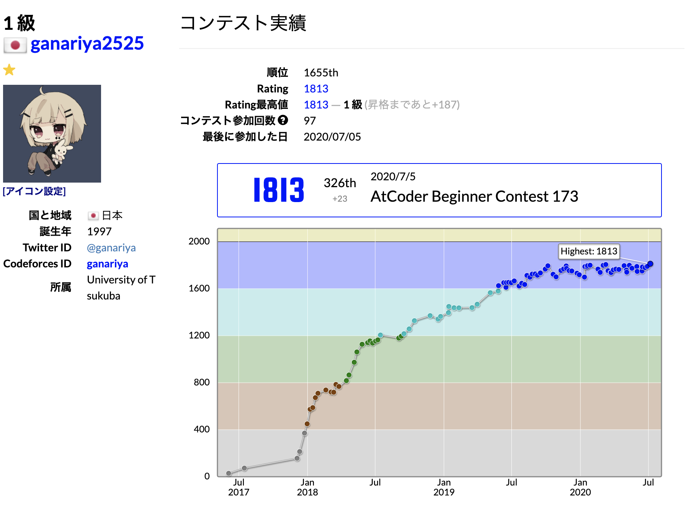

    

# 🐾 ganariya

- [HP](https://ganariya.github.io/whoami/)
- [works](https://ganariya.github.io/works/)
- [Qiita](https://qiita.com/ganariya)
- [Hatena](https://ganariya.hatenablog.com/)
- [Scrapbox](https://scrapbox.io/ganariya/)
- [YouTube](https://www.youtube.com/channel/UCPTKMrRhOSf30v59Ktbpl1A)
- [Twitter](https://twitter.com/ganariya)
- [whishlist](https://www.amazon.co.jp/hz/wishlist/ls/7297J1ZN3DSH)

# 🐾 Hobby

- Competitive Programming
- Programming
- Anime / niconico
- Virtual Youtuber
- HipHop-Rap
- 卯月コウ

# 🐾 Competitive Programming

    

- [AtCoder](https://atcoder.jp/users/ganariya2525)
- [Codeforces](https://codeforces.com/profile/ganariya)
- [YukiCoder](https://yukicoder.me/users/3037)

# 🐾 Qualification

- TOEIC: 925
- Fundamental Information Technology Engineer Examination　
- Applied Information Technology Engineer Examination
- ICPC Asia2018
- 第一回日本最強プログラマー学生選手権決勝
- 第二回全国統一プログラミング王決定戦本戦

# 🐾 Contiributes

Thanks to all contributors 🎉
Please contribute anythings!

<table>
  <tr>
    <td align="center"><a href="https://github.com/Suzumebati"> <a href="https://github.com/Ganariya" title="Code">:octocat: </a></a></td>
  </tr>
</table>